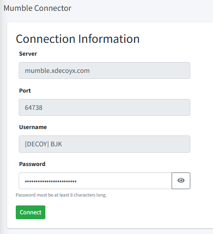

DECOY uses a variety of third-party web-applications and software:

- [SeAT](https://seat.xdecoyx.com/home) is a web-app for tracking in-game activity, along with sync'ing your user account to Discord/Mumble.
- [Discord](https://discord.com/) is software for chats, informal fleet comms, event noficiations and meetings.
- [Mumble](https://www.mumble.info/) is VoIP software for organised fleets.

### DECOY - SeAT Setup

The first time you access seat, you'll be prompted if you are in DECOY (Choose this one!) or if you're a Blue (used for communicating with other teams).

Registered your account, then link ALL of your pilots (whether they're in DECOY or not) by selecting the cog in the top-right and 'Link Character'.

---

### DECOY - Discord Setup

Once you've registered your pilots on SeAT, select 'Connector' and 'Identities' on the left, and join the Discord server. If you don't already have an account, you can create one for free at [Discord.gg](https://discord.gg).

---

### DECOY - Mumble Setup

In SeAT, access [Mumble](https://seat.xdecoyx.com/mumble).

Click 'Connect', and Mumble should open up and connect you automatically to our server.

**If it asks you for a password** - reload the [Mumble](https://seat.xdecoyx.com/mumble) page and click the eye symbol and copy the password to your clipboard, THEN hit connect.

Open the Mumble application and connect with the details visible on the screen (ensure your username as the [ALLIANCE TICKER]!). Paste your password and you're in!

---

### Other Services

We have access to Mumble/Discord for other alliances too. Reach out to BJK directly for this information.