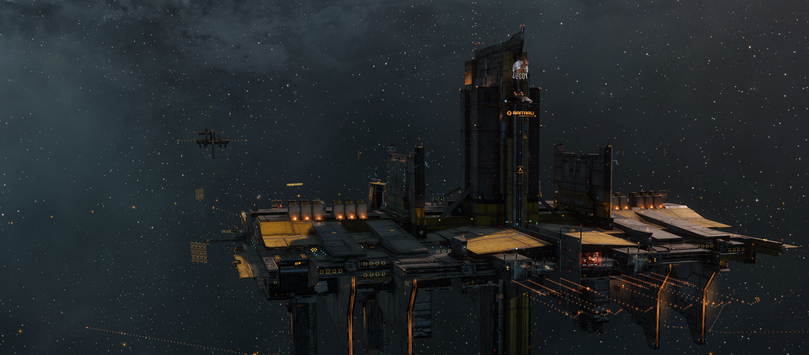
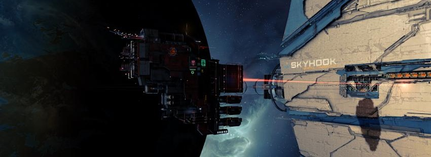

The home of DECOY is the Fortizar [R-2R0G - DECOY](https://evemaps.dotlan.net/map/Pure_Blind-Fade-Cloud_Ring/LY-FY6#ihub) in Pure Blind. The rest of this constellation has Astrahus, and all our citadels have compression facilities.

|System|Sec|Citadel|Minor|Major|Explo|Ore|Other|
|-|-|-|-|-|-|-|-|
|R-2R0G|-0.21|Fort|-|3|-|Zydrine 2|Cyno Beacon|
|M-YCD4|-0.18|Astra|-|1|-|Nocxium 2|-|
|Q-5211|-0.14|Astra|-|1|-|Mexallon 2|-|
|CR-AQH|-0.28|Astra|-|1|-|Megacyte 2|-|
|XQ-PXU|-0.15|Astra|-|1|-|Isogen 2|-|
|WW-KGD|-0.18|Astra|-|1|2|Zydrine 2|-|

* *R-2R0G and WW-KGD will toggle between the Zydrine belt and Major Array based on ADM*

---

## Industry Facilities

We have 3 Raitarus in R-2R0G with Material Efficiency Rigs:

### R-2R0G - zFuel + Equip
- [Ammunition](https://everef.net/types/37158) → T1/T2 ammo, charges, scripts.
- [Equipment](https://everef.net/types/43920) → Ship modules, weapons, rigs.
- [Structure](https://everef.net/types/43875) → Structures, structure modules, structure rigs.

### R-2R0G - zT1
- [Basic Medium Ship](https://everef.net/types/37146) → T1 + Faction Cruisers, Battlecruisers, Industrials, Mining Barges
- [Basic Large Ship](https://everef.net/types/43732) → T1 + Faction Battleships, Orca, Bowhead
- [Basic Capital Component](https://everef.net/types/43870) → T1 Capital Components

### R-2R0G - zT2
- [Advanced Medium Ship](https://everef.net/types/43858) → T2/T3 Cruisers, Battlecruisers and Subsystems
- [Advanced Large Ship](https://everef.net/types/43862) → T2 Battleships + JF's
- [Advanced Component](https://everef.net/types/43867) → T2 Cap Components, T1 Battleship Components, Data Interfaces + T3 Components

### Reprocessor

Coming Soon...

### Reactions

Coming Soon...

### Capital Manufacturing

Use a LowSec NPC station in range of R-2R0G after building your capital components here

---

## Mercenary Dens
These structures attach to Temperate Planets and generate Infomorph Decryption Keys, but slowly reduce the planets workforce, affecting our sovereignty upgrades.

It takes only 10 minutes to anchor a Mercenary Den, but shooting one generates a kill timer in 18~30 hours. For this reason, DECOY has anchored dens on all of our Temperate Planets to prevent hostiles from doing this.

Every 3 days, combat sites spawn across our space triggered by the Mercenary Dens, which can only be triggered by the Mercenary Den Owner. Completing these will **remove the workforce impact** - so DECOY will trigger these and anyone is welcome to run them. There are some fittings for dealing with these sites stored ingame:

`DECOY - Gila Mercenary Den`

`DECOY - Cynabal Mercenary Den`
