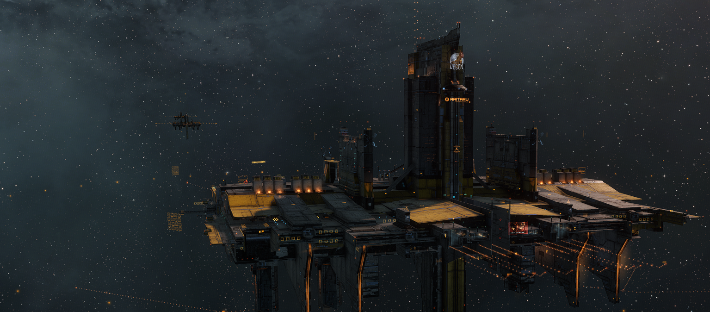
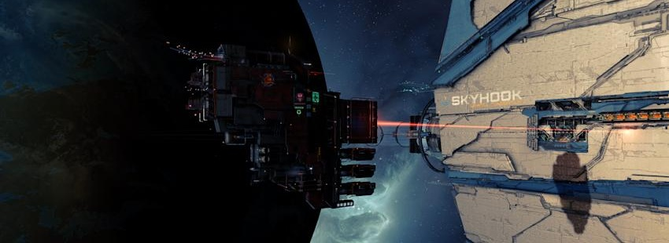

The home of DECOY is the Fortizar [T8H-66](https://evemaps.dotlan.net/map/Querious/T8H-66#sec) in Querious.

|System|Sec|Citadel|Minor|Major|Explo|Ore|Other|
|-|-|-|-|-|-|-|-|
|K-6K16|-0.43|Fort |-|2|-|Zydrine 1|Ansi|
|F-TE1T|-0.73|Astra|-|3|3|-|Ice|
|J-LPX7|-0.69|Astra|-|3|-|Nocxium 2|-|
|QY6-RK|-0.60|Astra|-|1|-|-|Ice|
|W-KQPI|-0.59|Astra|-|3|-|-|Ice|
|PUIG-F|-0.67|Astra|-|1|-|Megacyte 2|-|
|0-HDC8|-0.72|Astra|-|3|-|-|Ice + A0|
|SVM-3K|-0.63|Astra|-|1|-|-|-|

We also hold sov in a constellation in Querious:

|System|Sec|Citadel|Minor|Major|Explo|Ore|Other|
|-|-|-|-|-|-|-|-|
|A2-V27|-0.39|Fort|-|3|-|-|Ice|
|O3L-95|-0.37|Astra|-|1|-|Nocxium 2|-|
|A3-LOG|-0.26|Astra|-|1|-|Megacyte 2|-|
|T8H-66|-0.31|Fort|-|1|-|Zydrine 1|-|
|7V-KHW|-0.17|Astra|-|1|-|Isogen 2|-|
|0-WT2D|-0.12|Astra|-|1|-|Zydrine 2|-|

---

## Industry Facilities

### K-6K16 - Under New Management (Fortizar)
- [Blueprint Copy Optimization](https://everef.net/types/43729) - 42% reduction in Blueprint Copy times
- [Invention Optimization](https://everef.net/types/43722) - 42% reduction in Invention times

### K-6K16 - WTB Sotiyo
- [Advanced Component](https://everef.net/types/43867) → T2 Cap Components, T1 Battleship Components, Data Interfaces + T3 Components
- [Basic Large Ship](https://everef.net/types/43732) → T1 + Faction Battleships, Orca, Bowhead
- [Structure](https://everef.net/types/43875) → Structures, structure modules, structure rigs.

### K-6K16 - TATARA
- [Reactor Efficiency](https://everef.net/types/46496) → Reactions
- [Reprocessing Monitor](https://everef.net/types/46639) → Reprocessing

### Capital Manufacturing

Use an NPC station in range of K-6K16 after building your capital components here.

---

## Mercenary Dens
These structures attach to Temperate Planets and generate Infomorph Decryption Keys, but slowly reduce the planets workforce, affecting our sovereignty upgrades.

It takes only 10 minutes to anchor a Mercenary Den, but shooting one generates a kill timer in 18~30 hours. For this reason, DECOY has anchored dens on all of our Temperate Planets to prevent hostiles from doing this.

Every 3 days, combat sites spawn across our space triggered by the Mercenary Dens, which can only be triggered by the Mercenary Den Owner. Completing these will **remove the workforce impact** - so DECOY will trigger these and anyone is welcome to run them. There are some fittings for dealing with these sites stored ingame:

`DECOY - Gila Mercenary Den`

`DECOY - Cynabal Mercenary Den`
