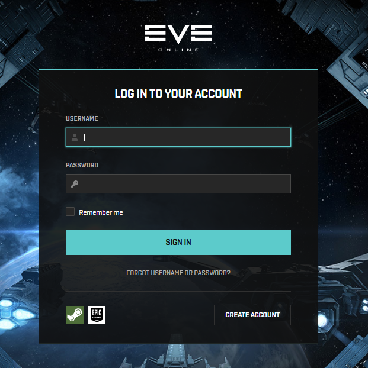

Example button

## Character Tracking

Whenever you login with your EVE Account (SeAT, AllianceAuth, RIFT, Pathfinder, SSO etc), you give a third party access to your character information for an **unlimited amount of time**. Your 'Token' (used to pull data) and 'Access Token' (used to keep your 'Token' alive) will persist unless you do one of two things:

1. Change the password on your account
2. Revoke access via [https://developers.eveonline.com](https://developers.eveonline.com/authorized-apps)

## What information does this token give?

EVE Online hosts an [API Explorer](https://developers.eveonline.com/api-explorer#/) designed to help developers write their applications.

Some information here is public, for example, if you go to [esi.evetech.net/incursions](https://esi.evetech.net/incursions), you will see active incursions in space. 

However, if you wanted to see a users [notifications](https://esi.evetech.net/characters/411225042/notifications/contacts), you would need a token. Different tracking website hold your tokens in their database, and can access this information periodically. For example, SeAT refreshes every 10 or 60 minutes depending on the data required.

## What do I need to do?

1. Access [https://developers.eveonline.com](https://developers.eveonline.com/authorized-apps)
2. Select your character
3. Revoke access from any application you do not wish to see your data (eg, COA Auth)
4. Repeat this process for ALL of your accounts.

