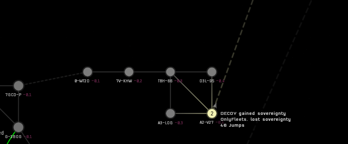

## The Story So Far...

We declined the following Non-Invasion Agreement from WinterCo:

```
Applicable to Decoy in WinterCo space and constellations, and also applicable to Winter Coalition in Decoy sov. 
No reinforcement or attacks on sov, structures, skyhooks, metenox drills or mercenary dens  (pinging, even for content, is not allowed),
No Skyhook raiding/stealing.
No excessive camping (specifically cloaked and/or at gates/stations) or farming campaigns.  (Running sites, including data/relic sites, routinely in WinCo space would be considered farming.) 

DECOY will not aid any alliance in attacking WinCo/Panfam structure or sovereignty timers,
DECOY will not give docking access or defense aid to any alliance who attacks WinCo/ sov or structures.
DECOY will not be subject to, or submit to, coercion to be used in a future conflict by either Imperium or WinCo.
WinCo will not source, fund, or support an attack on DECOY sov or structures.
```

It seems insane to us that WinterCo would honestly be this oppresive to a team with only 6 systems. Couple with the fact we need more space anyway, we chose to ignore their threats and move forwards.

We were able to push off WinterCo for quite some time, then the Pandemic Family collapsed and WitnerCo grew by ~10,000 characters in EUTZ overnight.

We've been having some great BRs against them so far:

https://br.evetools.org/br/6920e08806d75600125c1319

https://br.evetools.org/br/69221b447c65360013f7f1d9

However, with the 24/7 camping and the constant overwhelming amount of hostiles, it is time for us to look for a better place to settle.

## New Home - Querious

OnlyFleets have very generously offered us a constellation in Querious to settle. We will have a similar setup of Fort / Raitaru / Athanor in T8H-66, with Astrahus in each of the other systems. All systems will have a T2 Belt, except for the ice system of A2-.

This space borders LowSec which seems fairly active - our HD ships will definitely see some usage here.

We will support OnlyFleets with their pushes against PhoenixCo and I want to see DECOY leading some of these attacks. We will have opportunities to use our Leshaks, Machariels, FAX and Dreads - so the sooner we get down there, the sooner we get engaged.

This is an incredible opportunity and I'm very excited for what we will be about to achieve.

## How do we get there?

1. Move all of your assets from R-2R0G to Torrinos
2. Either repackage and smash the rigs, then set courier contracts up to DECOY STONKS at 3,000 isk/m3 (That's the return journey cost I'm afraid!)
3. Set a jump clone in Torrinos and Tartoken whilst your ships are still there. We will move caps later
4. Travel to our new Fort!

## I can't make it online this week! What next?

The system of R-2R0G has asset safety across in Anin. We will be able to provide courier service between there and our new home.