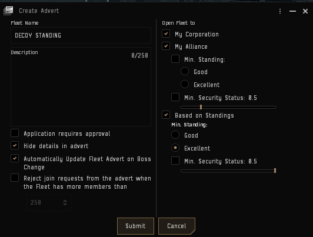

# Standing Fleet

As soon as you login, join the DECOY Standing Fleet.

However, if there is no fleet available, follow these steps:

1. Navigate to your Fleet Window, and 'Create New Fleet'
2. Rename your wing 'Auto-Join', and rename this squad 'AutoJoin'. Right-click this squad and choose 'Set Auto Join'
3. Create a new Wing, and then 15 new squads underneath this.
4. In your fleet options (3 dots), select 'Set Freemove'
5. Open the MOTD and paste the following:
```
<font size="12" color="#bfffffff"><br></font><font size="24" color="#ffffffff">DECOY STANDING FLEET<br><br></font><font size="12" color="#ffffffff">- Bring pilots into the Standing Fleet<br>- Join Mumble, either AFK or Standing Fleet -> Quiet Room<br>- It's okay to be on Corp Comms until there's a fight!</font>
```
6. Create a new advert with the following:

